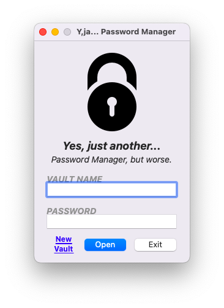

# Yes, just another... Password Manager, but worse. 

The title says it all: Yes, just another password manager, but worse. There are plenty of truly fantastic password managers out there. Just to name a few: 1Password, LastPass, NordPass, KeePass, Keeper, Bitwarden, and the list goes on. All of them are undoubtedly better than this one.

Let me walk you through why this is *definitely* a worse password manager:

- **Open Source**: Every single line of code is out in the open for you to scrutinize, test, debug, or even tweak if you’re feeling adventurous. No backdoors, no hidden surprises. You can even audit the code for bugs.
- **Local Storage Only**: All your data stays snug and cozy on your computer. Not a single byte of information will ever leave your device. (Seriously, this software couldn’t call home even if it wanted to.)
- **AES256 Encryption**: Passwords are stored in “Vaults,” and each Vault is encrypted with the AES256 algorithm—because "military-grade encryption" just sounds so cliché.
- **Unlimited Vaults**: You can create as many Vaults as your paranoid heart desires. Each Vault is secured with its own unique combination of a name and password. Yes, you can have multiple Vaults with the same name as long as their passwords are different. Because why not?
- **Portable Vaults**: You can export your Vaults and import them on other devices. 
- **Minimalist, Non-Invasive Design**: It's so simple it’s almost suspicious. And if you hate GUIs, good news—you can even run it from the command line. Hardcore, right?

---

## How It Works

### Step 1: The Initial Screen  

---

### Step 2: Inside a Vault  

---

### Step 3: Accessing Items  

---

Personally, I’ve always believed that a good user interface is like a joke—if you have to explain it, it’s not that great. So, honestly, I think this software doesn’t need much more explaining. 

---

## Install

- [Download](https://github.com/GabrielVF/Yja-Password-Manager/releases/download/v1.0.0/YjaPasswordManager.app.zip), and drag the app to Applications folder. 

---

## Requirements

- **macOS**: This app is designed exclusively for macOS. Windows and Linux versions? Maybe someday… if I get enough funding. 
- **Xojo License**: If you want to compile the code yourself, you'll need a compatible Xojo license.

---

## Why Xojo?

This software is built using **Xojo**. Why? Well, I like Xojo. As a lone, hobbyist developer, it allows me to be more productive. This does come with a catch: you’ll need a compatible Xojo license if you want to compile the code yourself. (Yes, compiling it yourself is absolutely encouraged, but you’ll have to bring your own license to the party.)

---

## Disclaimer  

This software is provided "as is", without warranty of any kind, express or implied, including but not limited to the warranties of merchantability, fitness for a particular purpose and noninfringement. In no event shall the authors or copyright holders be liable for any claim, damages or other liability, whether in an action of contract, tort or otherwise, arising from, out of or in connection with the software or the use or other dealings in the software.  

App icon made by SimpleIcon from www.flaticon.com under [CC BY 3.0](https://creativecommons.org/licenses/by/3.0/).

